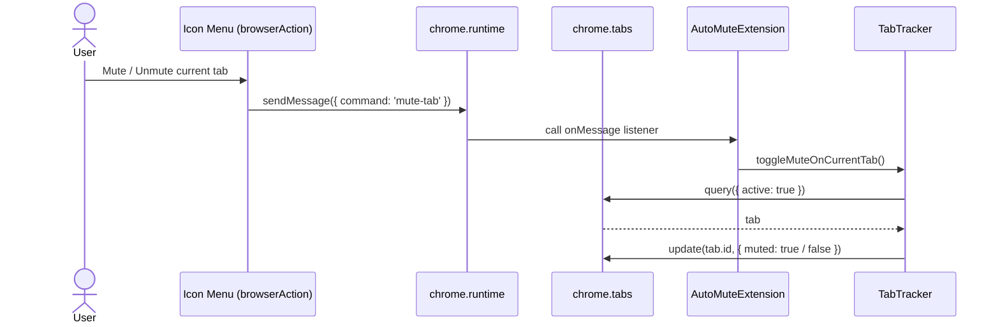

# Icon Menu
This is the drop-down menu that appears when the user clicks the extension
icon in the top-right corner of the browser.

## Mute / Unmute current tab

```mermaid
sequenceDiagram
   actor user as User
   participant browserAction as Icon Menu (browserAction)
   participant runtime as chrome.runtime
   participant tabs as chrome.tabs
   participant extension as AutoMuteExtension
   participant tracker as TabTracker

    user->>browserAction: Mute / Unmute current tab
    browserAction->>runtime: sendMessage({ command: 'mute-tab' })
    runtime->>extension: call onMessage listener
    extension->>tracker: toggleMuteOnCurrentTab()
    tracker->>tabs: query({ active: true })
    tabs-->>tracker: tab
    tracker->>tabs: update(tab.id, { muted: true / false })
```