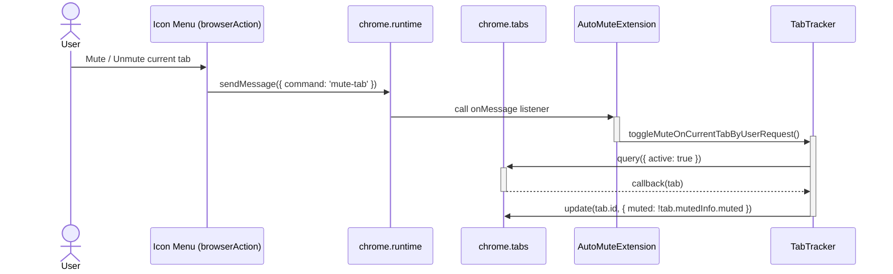
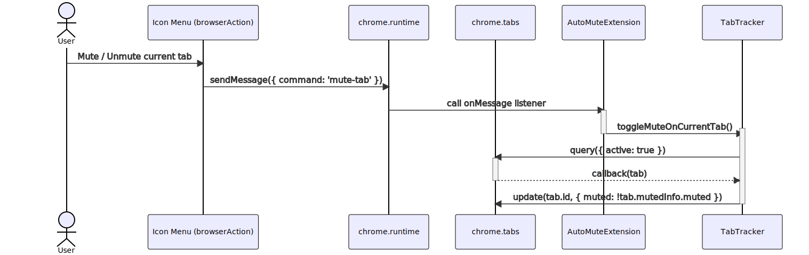
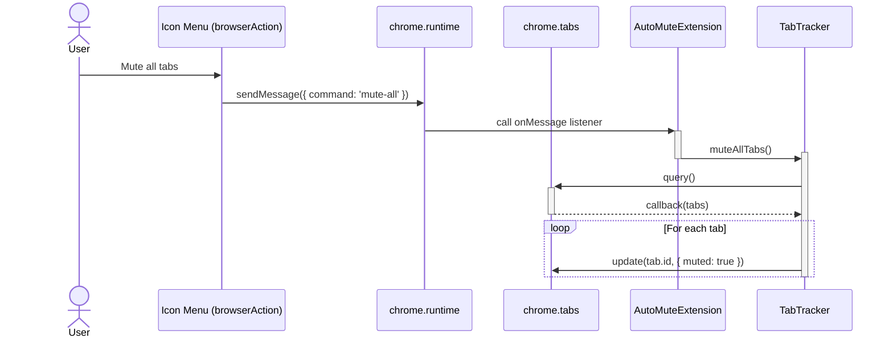
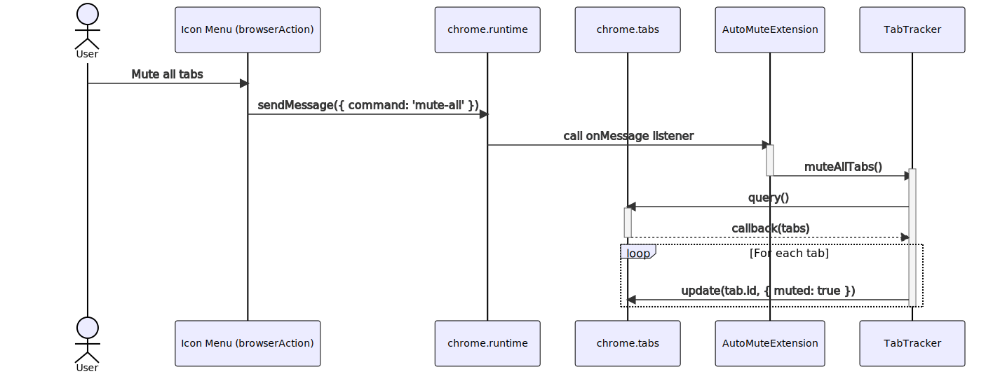
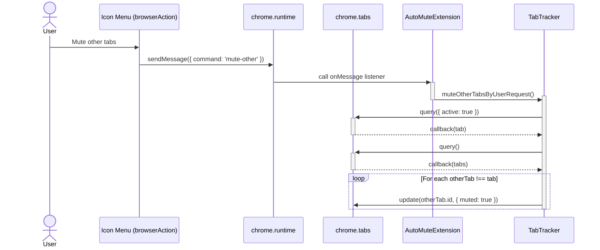
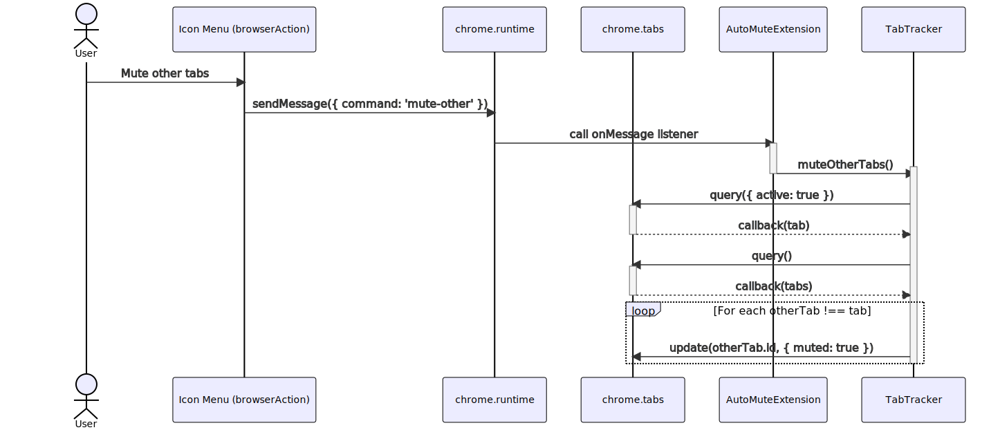
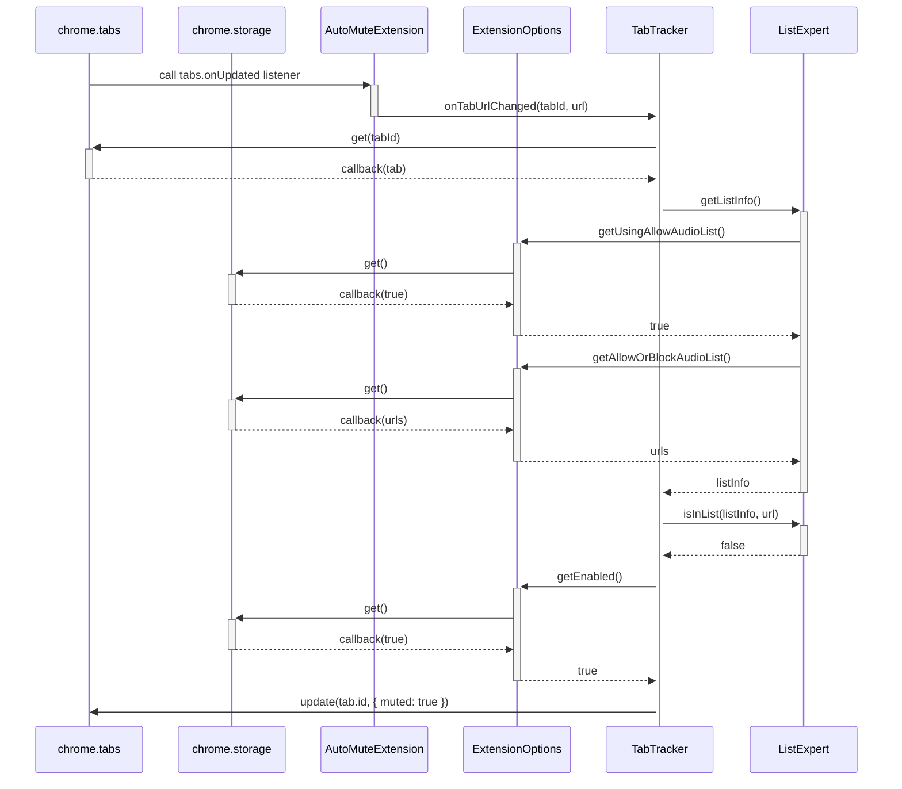
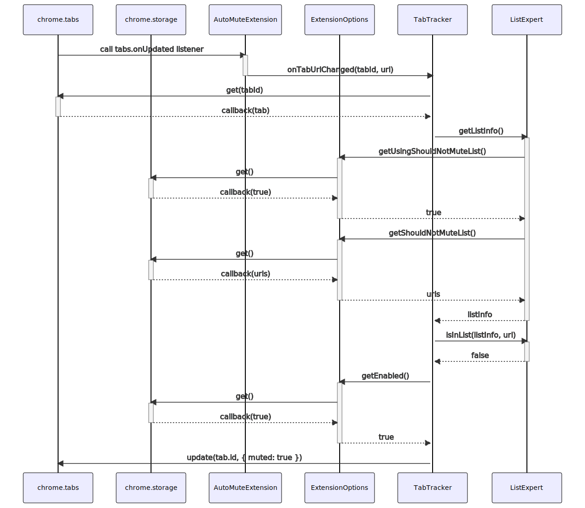

# About Mermaid Diagrams

These diagrams are written in the [Mermaid](https://mermaid-js.github.io/mermaid/#/) diagramming
language. Currently, GitHub doesn't support mermaid natively, though it's a
[poular request](https://github.community/t/feature-request-support-mermaid-markdown-graph-diagrams-in-md-files/1922).

You can see what these diagrams should look like by copy-pasting the code into a
[mermaid live editor](https://mermaid.live). I have included direct links for each diagram.
Hopefully I can remember to keep them updated. I also have included a rendered image of each.
This is even less likely to be kept up-to-date.

## Icon Menu

This is the drop-down menu that appears when the user clicks the extension
icon in the top-right corner of the browser.

### Mute / Unmute current tab

[Diagram link](https://mermaid.live/edit/#eyJjb2RlIjoic2VxdWVuY2VEaWFncmFtXG4gICBhY3RvciB1c2VyIGFzIFVzZXJcbiAgIHBhcnRpY2lwYW50IGJyb3dzZXJBY3Rpb24gYXMgSWNvbiBNZW51IChicm93c2VyQWN0aW9uKVxuICAgcGFydGljaXBhbnQgcnVudGltZSBhcyBjaHJvbWUucnVudGltZVxuICAgcGFydGljaXBhbnQgdGFicyBhcyBjaHJvbWUudGFic1xuICAgcGFydGljaXBhbnQgZXh0ZW5zaW9uIGFzIEF1dG9NdXRlRXh0ZW5zaW9uXG4gICBwYXJ0aWNpcGFudCB0cmFja2VyIGFzIFRhYlRyYWNrZXJcblxuICAgIHVzZXItPj5icm93c2VyQWN0aW9uOiBNdXRlIC8gVW5tdXRlIGN1cnJlbnQgdGFiXG4gICAgYnJvd3NlckFjdGlvbi0-PnJ1bnRpbWU6IHNlbmRNZXNzYWdlKHsgY29tbWFuZDogJ211dGUtdGFiJyB9KVxuICAgIHJ1bnRpbWUtPj4rZXh0ZW5zaW9uOiBjYWxsIG9uTWVzc2FnZSBsaXN0ZW5lclxuICAgIGV4dGVuc2lvbi0-Pit0cmFja2VyOiB0b2dnbGVNdXRlT25DdXJyZW50VGFiKClcbiAgICBkZWFjdGl2YXRlIGV4dGVuc2lvblxuICAgIHRyYWNrZXItPj4rdGFiczogcXVlcnkoeyBhY3RpdmU6IHRydWUgfSlcbiAgICB0YWJzLS0-Pi10cmFja2VyOiBjYWxsYmFjayh0YWIpXG4gICAgdHJhY2tlci0-PnRhYnM6IHVwZGF0ZSh0YWIuaWQsIHsgbXV0ZWQ6ICF0YWIubXV0ZWRJbmZvLm11dGVkIH0pXG4gICAgZGVhY3RpdmF0ZSB0cmFja2VyIiwibWVybWFpZCI6IntcbiAgXCJ0aGVtZVwiOiBcImRlZmF1bHRcIlxufSIsInVwZGF0ZUVkaXRvciI6ZmFsc2UsImF1dG9TeW5jIjp0cnVlLCJ1cGRhdGVEaWFncmFtIjpmYWxzZX0)

### Mute all tabs

[Diagram link](https://mermaid.live/edit/#eyJjb2RlIjoic2VxdWVuY2VEaWFncmFtXG4gICAgYWN0b3IgdXNlciBhcyBVc2VyXG4gICAgcGFydGljaXBhbnQgYnJvd3NlckFjdGlvbiBhcyBJY29uIE1lbnUgKGJyb3dzZXJBY3Rpb24pXG4gICAgcGFydGljaXBhbnQgcnVudGltZSBhcyBjaHJvbWUucnVudGltZVxuICAgIHBhcnRpY2lwYW50IHRhYnMgYXMgY2hyb21lLnRhYnNcbiAgICBwYXJ0aWNpcGFudCBleHRlbnNpb24gYXMgQXV0b011dGVFeHRlbnNpb25cbiAgICBwYXJ0aWNpcGFudCB0cmFja2VyIGFzIFRhYlRyYWNrZXJcblxuICAgIHVzZXItPj5icm93c2VyQWN0aW9uOiBNdXRlIGFsbCB0YWJzXG4gICAgYnJvd3NlckFjdGlvbi0-PnJ1bnRpbWU6IHNlbmRNZXNzYWdlKHsgY29tbWFuZDogJ211dGUtYWxsJyB9KVxuICAgIHJ1bnRpbWUtPj4rZXh0ZW5zaW9uOiBjYWxsIG9uTWVzc2FnZSBsaXN0ZW5lclxuICAgIGV4dGVuc2lvbi0-Pit0cmFja2VyOiBtdXRlQWxsVGFicygpXG4gICAgZGVhY3RpdmF0ZSBleHRlbnNpb25cbiAgICB0cmFja2VyLT4-K3RhYnM6IHF1ZXJ5KClcbiAgICB0YWJzLS0-Pi10cmFja2VyOiBjYWxsYmFjayh0YWJzKVxuICAgIGxvb3AgRm9yIGVhY2ggdGFiXG4gICAgICAgIHRyYWNrZXItPj50YWJzOiB1cGRhdGUodGFiLmlkLCB7IG11dGVkOiB0cnVlIH0pXG4gICAgZW5kXG4gICAgZGVhY3RpdmF0ZSB0cmFja2VyIiwibWVybWFpZCI6IntcbiAgXCJ0aGVtZVwiOiBcImRlZmF1bHRcIlxufSIsInVwZGF0ZUVkaXRvciI6ZmFsc2UsImF1dG9TeW5jIjp0cnVlLCJ1cGRhdGVEaWFncmFtIjpmYWxzZX0)

### Mute other tabs

[Diagram link](https://mermaid.live/edit/#eyJjb2RlIjoic2VxdWVuY2VEaWFncmFtXG4gICAgYWN0b3IgdXNlciBhcyBVc2VyXG4gICAgcGFydGljaXBhbnQgYnJvd3NlckFjdGlvbiBhcyBJY29uIE1lbnUgKGJyb3dzZXJBY3Rpb24pXG4gICAgcGFydGljaXBhbnQgcnVudGltZSBhcyBjaHJvbWUucnVudGltZVxuICAgIHBhcnRpY2lwYW50IHRhYnMgYXMgY2hyb21lLnRhYnNcbiAgICBwYXJ0aWNpcGFudCBleHRlbnNpb24gYXMgQXV0b011dGVFeHRlbnNpb25cbiAgICBwYXJ0aWNpcGFudCB0cmFja2VyIGFzIFRhYlRyYWNrZXJcblxuICAgIHVzZXItPj5icm93c2VyQWN0aW9uOiBNdXRlIG90aGVyIHRhYnNcbiAgICBicm93c2VyQWN0aW9uLT4-cnVudGltZTogc2VuZE1lc3NhZ2UoeyBjb21tYW5kOiAnbXV0ZS1vdGhlcicgfSlcbiAgICBydW50aW1lLT4-K2V4dGVuc2lvbjogY2FsbCBvbk1lc3NhZ2UgbGlzdGVuZXJcbiAgICBleHRlbnNpb24tPj4rdHJhY2tlcjogbXV0ZU90aGVyVGFicygpXG4gICAgZGVhY3RpdmF0ZSBleHRlbnNpb25cbiAgICB0cmFja2VyLT4-K3RhYnM6IHF1ZXJ5KHsgYWN0aXZlOiB0cnVlIH0pXG4gICAgdGFicy0tPj4tdHJhY2tlcjogY2FsbGJhY2sodGFiKVxuICAgIHRyYWNrZXItPj4rdGFiczogcXVlcnkoKVxuICAgIHRhYnMtLT4-LXRyYWNrZXI6IGNhbGxiYWNrKHRhYnMpXG4gICAgbG9vcCBGb3IgZWFjaCBvdGhlclRhYiAhPT0gdGFiXG4gICAgICAgIHRyYWNrZXItPj50YWJzOiB1cGRhdGUob3RoZXJUYWIuaWQsIHsgbXV0ZWQ6IHRydWUgfSlcbiAgICBlbmRcbiAgICBkZWFjdGl2YXRlIHRyYWNrZXIiLCJtZXJtYWlkIjoie1xuICBcInRoZW1lXCI6IFwiZGVmYXVsdFwiXG59IiwidXBkYXRlRWRpdG9yIjpmYWxzZSwiYXV0b1N5bmMiOnRydWUsInVwZGF0ZURpYWdyYW0iOmZhbHNlfQ)

## Tab Events

These events are fired by the browser in response to the user performing actions such as
opening a new tab or navigating to a new page.

### User navigates to a new URL

In this example, the user is using a "should not mute list", and the
URL navigated to is not in the list, so it should be muted.

[Diagram link](https://mermaid.live/edit/#eyJjb2RlIjoic2VxdWVuY2VEaWFncmFtXG4gICAgcGFydGljaXBhbnQgdGFicyBhcyBjaHJvbWUudGFic1xuICAgIHBhcnRpY2lwYW50IHN0b3JhZ2UgYXMgY2hyb21lLnN0b3JhZ2VcbiAgICBwYXJ0aWNpcGFudCBleHRlbnNpb24gYXMgQXV0b011dGVFeHRlbnNpb25cbiAgICBwYXJ0aWNpcGFudCBlT3B0aW9ucyBhcyBFeHRlbnNpb25PcHRpb25zXG4gICAgcGFydGljaXBhbnQgdHJhY2tlciBhcyBUYWJUcmFja2VyXG4gICAgcGFydGljaXBhbnQgbGlzdCBhcyBMaXN0RXhwZXJ0XG5cbiAgICB0YWJzLT4-K2V4dGVuc2lvbjogY2FsbCB0YWJzLm9uVXBkYXRlZCBsaXN0ZW5lclxuICAgIGV4dGVuc2lvbi0-Pit0cmFja2VyOiBvblRhYlVybENoYW5nZWQodGFiSWQsIHVybClcbiAgICBkZWFjdGl2YXRlIGV4dGVuc2lvblxuICAgIHRyYWNrZXItPj4rdGFiczogZ2V0KHRhYklkKVxuICAgIHRhYnMtLT4-LXRyYWNrZXI6IGNhbGxiYWNrKHRhYilcbiAgICB0cmFja2VyLT4-K2xpc3Q6IGdldExpc3RJbmZvKClcbiAgICBsaXN0LT4-K2VPcHRpb25zOiBnZXRVc2luZ1Nob3VsZE5vdE11dGVMaXN0KClcbiAgICBlT3B0aW9ucy0-PitzdG9yYWdlOiBnZXQoKVxuICAgIHN0b3JhZ2UtLT4-LWVPcHRpb25zOiBjYWxsYmFjayh0cnVlKVxuICAgIGVPcHRpb25zLS0-Pi1saXN0OiB0cnVlXG4gICAgbGlzdC0-PitlT3B0aW9uczogZ2V0U2hvdWxkTm90TXV0ZUxpc3QoKVxuICAgIGVPcHRpb25zLT4-K3N0b3JhZ2U6IGdldCgpXG4gICAgc3RvcmFnZS0tPj4tZU9wdGlvbnM6IGNhbGxiYWNrKHVybHMpXG4gICAgZU9wdGlvbnMtLT4-LWxpc3Q6IHVybHNcbiAgICBsaXN0LS0-Pi10cmFja2VyOiBsaXN0SW5mb1xuICAgIHRyYWNrZXItPj4rbGlzdDogaXNJbkxpc3QobGlzdEluZm8sIHVybClcbiAgICBsaXN0LS0-Pi10cmFja2VyOiBmYWxzZVxuICAgIHRyYWNrZXItPj4rZU9wdGlvbnM6IGdldEVuYWJsZWQoKVxuICAgIGVPcHRpb25zLT4-K3N0b3JhZ2U6IGdldCgpXG4gICAgc3RvcmFnZS0tPj4tZU9wdGlvbnM6IGNhbGxiYWNrKHRydWUpXG4gICAgZU9wdGlvbnMtLT4-LXRyYWNrZXI6IHRydWVcbiAgICB0cmFja2VyLT4-dGFiczogdXBkYXRlKHRhYi5pZCwgeyBtdXRlZDogdHJ1ZSB9KSIsIm1lcm1haWQiOiJ7XG4gIFwidGhlbWVcIjogXCJkZWZhdWx0XCJcbn0iLCJ1cGRhdGVFZGl0b3IiOmZhbHNlLCJhdXRvU3luYyI6dHJ1ZSwidXBkYXRlRGlhZ3JhbSI6ZmFsc2V9)

