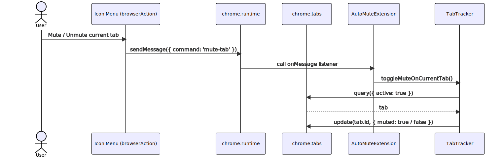

# About Mermaid Diagrams
These diagrams are written in the [Mermaid](https://mermaid-js.github.io/mermaid/#/) diagramming
language. Currently, GitHub doesn't support mermaid natively, though it's a
[poular request](https://github.community/t/feature-request-support-mermaid-markdown-graph-diagrams-in-md-files/1922).

You can see what these diagrams should look like by copy-pasting the code into a
[mermaid live editor](https://mermaid.live). I have included direct links for each diagram.
Hopefully I can remember to keep them updated. I also have included a rendered image of each.
This is even less likely to be kept up-to-date.

## Icon Menu
This is the drop-down menu that appears when the user clicks the extension
icon in the top-right corner of the browser.

### Mute / Unmute current tab

[Diagram link](https://mermaid.live/edit/#eyJjb2RlIjoic2VxdWVuY2VEaWFncmFtXG4gICBhY3RvciB1c2VyIGFzIFVzZXJcbiAgIHBhcnRpY2lwYW50IGJyb3dzZXJBY3Rpb24gYXMgSWNvbiBNZW51IChicm93c2VyQWN0aW9uKVxuICAgcGFydGljaXBhbnQgcnVudGltZSBhcyBjaHJvbWUucnVudGltZVxuICAgcGFydGljaXBhbnQgdGFicyBhcyBjaHJvbWUudGFic1xuICAgcGFydGljaXBhbnQgZXh0ZW5zaW9uIGFzIEF1dG9NdXRlRXh0ZW5zaW9uXG4gICBwYXJ0aWNpcGFudCB0cmFja2VyIGFzIFRhYlRyYWNrZXJcblxuICAgIHVzZXItPj5icm93c2VyQWN0aW9uOiBNdXRlIC8gVW5tdXRlIGN1cnJlbnQgdGFiXG4gICAgYnJvd3NlckFjdGlvbi0-PnJ1bnRpbWU6IHNlbmRNZXNzYWdlKHsgY29tbWFuZDogJ211dGUtdGFiJyB9KVxuICAgIHJ1bnRpbWUtPj5leHRlbnNpb246IGNhbGwgb25NZXNzYWdlIGxpc3RlbmVyXG4gICAgZXh0ZW5zaW9uLT4-dHJhY2tlcjogdG9nZ2xlTXV0ZU9uQ3VycmVudFRhYigpXG4gICAgdHJhY2tlci0-PnRhYnM6IHF1ZXJ5KHsgYWN0aXZlOiB0cnVlIH0pXG4gICAgdGFicy0tPj50cmFja2VyOiB0YWJcbiAgICB0cmFja2VyLT4-dGFiczogdXBkYXRlKHRhYi5pZCwgeyBtdXRlZDogdHJ1ZSAvIGZhbHNlIH0pIiwibWVybWFpZCI6IntcbiAgXCJ0aGVtZVwiOiBcImRhcmtcIlxufSIsInVwZGF0ZUVkaXRvciI6ZmFsc2UsImF1dG9TeW5jIjp0cnVlLCJ1cGRhdGVEaWFncmFtIjpmYWxzZX0)

